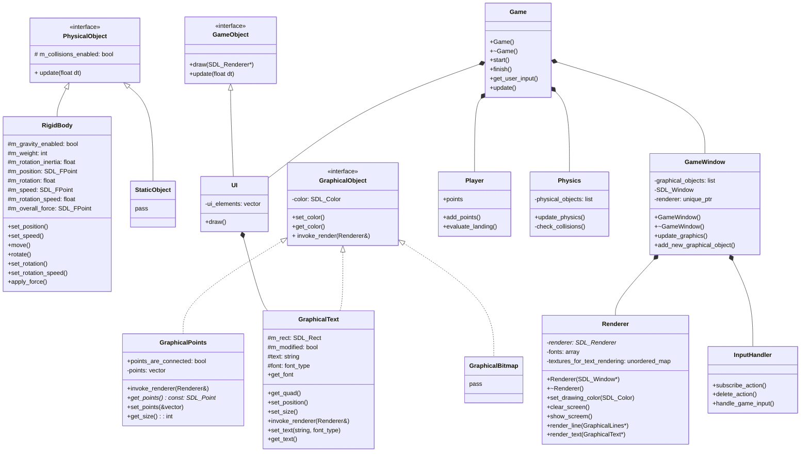

# Lunar Lander
Lunar Lander game clone from Atari arcade machine

[Wiki](https://en.wikipedia.org/wiki/Lunar_Lander_(1979_video_game))

Built using C++, SDL2, and Cmake.
An educational project to better learn object oriented programming and design patterns.


## Install instructions:
1. Clone the repository.
2. Install dependencies using Conan.

```bash
conan install . --build=missing
```
for a debug version you can add `--settings=build_type=Debug`

3. Configure and build the project with CMake.

```bash
cmake --preset conan-release
cmake --build --preset conan-release
```

for a debug version you can use `conan-debug`

4. Run the executable.

```bash
./build/Release/lunar-lander
```

## Proposed class diagram:


